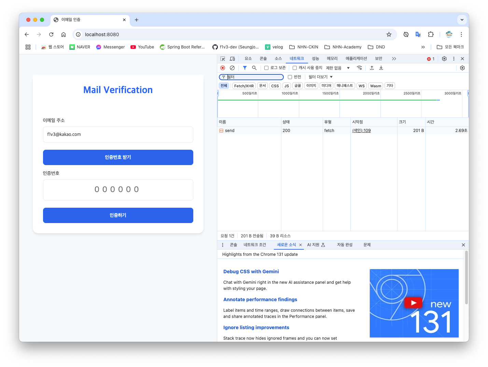
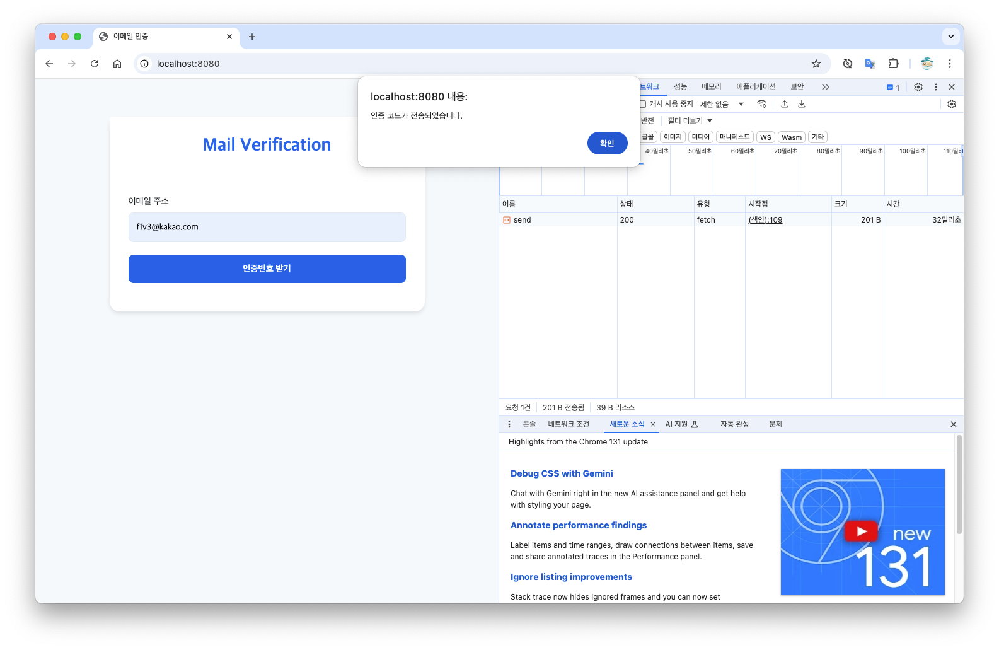

# email-verification

- JavaMailSender
- Spring Boot Mail
- Thymeleaf
- Caffeine Cache

### 개선해볼만한 사항

1. 인증번호 받기를 누른 후 메일 보내기 성공의 응답까지 너무 오랜 시간 대기
2. 악의적으로 계속해서 메일을 보내는 경우를 막기 위한 방법은 없을까?

## 비동기 적용 (@Async)

_기존 방식_

약 3초가 걸리는 모습

_비동기 적용 후_

32ms 만에 응답 

어떻게 동작하는지에 대해서 찾아보자. 

- https://brunch.co.kr/@springboot/401
- https://youtu.be/HKlUvCv9hvA?si=tWHwBW8nE7woO7TL